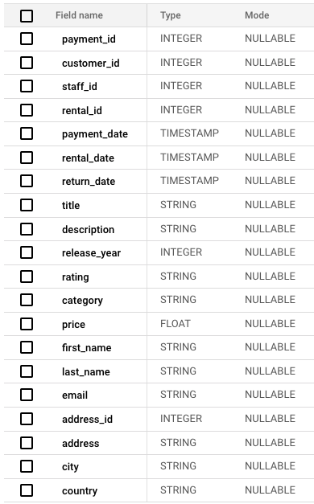

# Airflow Pipeline for Movie Rental Analytics

In this project, I used a PostgreSQL sample [database](https://www.postgresqltutorial.com/postgresql-getting-started/postgresql-sample-database/) to emulate a DVD Rental Business. Like a lot of businesses, the DVD Rental uses PostgreSQL database for their day-to-day business. The ERD for the Postgres database is shown below.


The DVD Rental business owners would like to get some insight on what movie title, category, and rating are bringing most money and have this data broken-down geographically.   

There are two DAG files that I created for this project. First DAG - [generate_transations.py](dags/generate_transaction.py) is used to emulate real-world transactions. The second DAG [push_latest_to_bq.py](dags/push_latest_to_bq.py) is for loading historic transaction data from PostgreSQL into BigQuery Warehouse/Data Mart for data analytics. The last part of the project is a simple DVD Rental [Dashboard](https://lookerstudio.google.com/reporting/8d7374ba-2cc5-4ecb-a890-313dccc8734f) created in Looker Studio using the data from BigQuery. 

## Part I - Transaction Generator

For the second DAG to work, we need to generate new rental transactions. I decided to use Airflow for this task since it is easy to design and monitor your code execution. Airflow also gives you a lot flexibility when it comes to scheduling your DAG runs. 

Below is the code for the DAG definition:

```python
from airflow import DAG
from airflow.operators.python import PythonOperator
from datetime import datetime, timedelta
import pendulum

#executables
import scripts.create_transaction as sct

with DAG(dag_id="transaction_generator", 
         description="Transaction simulator. Creates a transactioin record in the DB.",
         schedule_interval=timedelta(minutes=2),
         # pendulum is used to create an "aware" datetime objects 
         start_date=pendulum.datetime(2024, 2, 21, tz='America/Chicago'),
         end_date= pendulum.datetime(2024, 3, 4, 10, 10, tz='America/Chicago'),
         catchup=False,
         max_active_runs=1,         
         default_args={
             "email": ["dervish-tankful-0f@icloud.com"],
             "email_on_failure": True,
             "retries": 1,
             "retry_delay": timedelta(minutes=5),
             "owner": "JD"
             }
         ) as dag:
```
I usually run this DAG for an hour or so every day and generate a new transaction every second. You can run it without end_date, but be aware of your resources especially if you run it locally. 

To generate a new rental transaction, I have to update two tables: payment and rental. I used Airflow <i>PythonOperator</i> to split DAG tasks. There are 4 tasks in this DAG:

```python
create_transaction = PythonOperator(
     task_id="create_transaction",
     python_callable = sct.create_transaction
)

load_existing_users = PythonOperator(
     task_id="load_exisitng_users",
     python_callable = sct.load_exisiting_users
)

insert_payment = PythonOperator(
     task_id = "insert_payment",
     python_callable = sct.insert_payment_transaction
)

insert_rental = PythonOperator(
     task_id = "insert_rental",
     python_callable = sct.insert_rental_transaction
)
    
```

To keep the DAG clean, I used a separate module for the implementation - [create_transaction.py](./dags/scripts/create_transaction.py).

First, we load the existing data from the payment and rental tables join them, and save the data in a CSV file for the next task. Then, we load the CSV file into a pandas DataFrame and generate two new rows for both rental and payment tables which will count as a single real-world transaction. After, the new transaction data is written in the PostgreSQL database.

## Part II - Extract and Load Data into a Warehouse

The second DAG [push_latest_to_bq.py](./dags/push_latest_to_bq.py) can be run daily to load the latest rental transactions into a warehouse. I chose Cloud Storage / BigQuery combination because of the easy integration with Airflow. Additionally, BigQuery is a great choice due to its schema design flexibility and versatility; it can be used as a DataLake, Warehouse, and DataMart. 

BigQuery warehouse schema



Below is the DAG definition:
```python   
with DAG(dag_id='sync_transactions_to_bq', 
         catchup= False, 
         schedule='@daily',
         start_date=datetime(2024, 2, 1)
         ) as dag:
```
First, I load the last update date from BigQuery to see which transaction was loaded last. Then, I load the new data from PostgreSQL database from that date up. 

The Cloud Storage is used to store the data as a CSV file and transfer it to the BigQuery warehouse. The last task deletes the CSV file from Cloud Storage. One thing to note: if we were to run this DAG concurrently, then we would have to include a timestamp in the CSV file name so the files don't not get overwritten or deleted by the concurrent DAG runs.

## Part III - Data Analysis 

I used Looker Studio to create a [simple dashboard](https://lookerstudio.google.com/reporting/8d7374ba-2cc5-4ecb-a890-313dccc8734f) to illustrate the latest trends in movie rentals by country.

The most popular movie title worldwide is "Wale Bikini". It's mostly popular in United States followed by China. 

The most profitable category is Comedy. The most profitable movie ratings are PG-13 and PG. 

## Technologies

Python, SQL, BigQuery, Cloud Storage, Looker Studio, Airflow, pandas, PostgreSQL, Docker